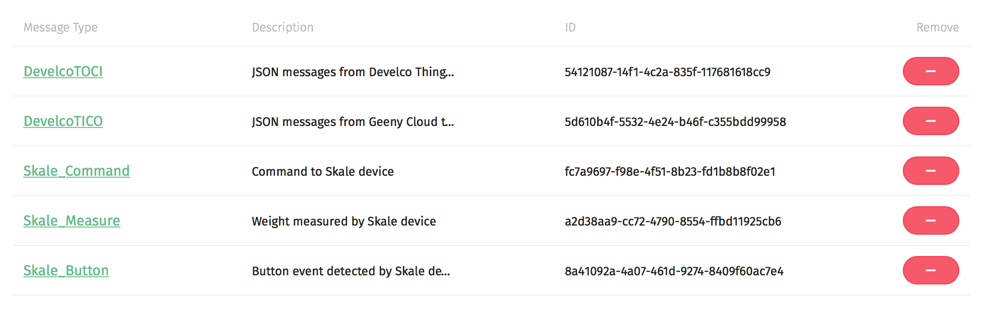
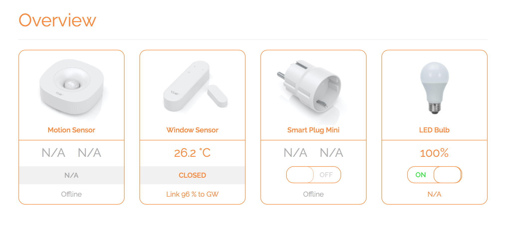
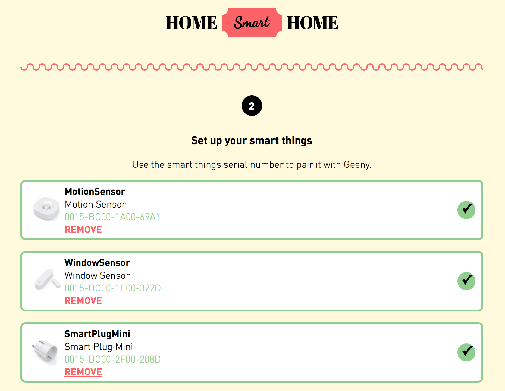

# Geeny's Hackathon

This is the log of our hacking adventures at Geeny's.
TL;DR: we made an application which actually works

The solution we developed (rather a set of problems we came up with) is called the `Geeny's office annoyatron`, a.k.a. How to make friends in the office.

The `annoyatron` consists of two incredible helpful features:

* A friendly reminder over the `team's slack channel` every time a window is opened and closed, lovely isn't?
* Turn a light ON everytime someone is assigned to a new issue, fun! never miss out a Project Manager's ticket!


## The implementation

The implementation is a joint effort from [Geeny](https://www.geeny.io) and [IFTTT](https://www.ifttt.com) to bring happiness over [Slack](https://geenyhackathon.slack.com) and [Github](https://github.com/alignan).

A `Formula` has been deployed to Geeny's Docker registry, based on the [Geeny's Hackathon 2018 repository](https://github.com/geeny/Hackathon2018), with minor modifications:

* Added a `last-msg` endpoint to retrieve the last message only (instead of the whole history at the `/msgs` endpoint)
* Publish to `IFTTT's Webhook` trigger (see: https://ifttt.com/maker_webhooks) 

Overall this is what our architecture looks like:


The `Formula` runs in a [Docker Machine](https://www.docker.com) deployed at Geeny.  The following `MessageTypes` are associated to the `Formula`:



And the `Formula` is deployed as:

````bash
docker build -t "registry.geeny.io/21b11b72-f1d8-44de-9972-caa248f6dcd1" -f Dockerfile .
docker push "registry.geeny.io/21b11b72-f1d8-44de-9972-caa248f6dcd1"
````

The following endpoints are exposed:

* `/send-message`: used to send commands to subscribed devices
* `/last-msg`: as explained before, shows the last message received

The `Develco` devices were associated to the local Gateway, its status is shown at the device's `IP:80` webserver:



At the `IP:8000` webserver the Gateway can be registered to `Geeny`:



And now the devices are reachable over `Geeny`... here are our things:

````bash
{
    "meta": {
        "offset": 0,
        "limit": 50
    },
    "data": [
        {
            "id": "e705edaa-329a-42b7-96a9-64359d8859db",
            "name": "Window Sensor",
            "serial_number": "0015bc001e00322d",
            "thing_type": "d6e479ea-c4fc-4204-9534-fc310a54ecd2",
            "created": "2017-12-15T09:07:27.902Z"
        },
        {
            "id": "953fc4fa-1a64-4cd8-ba9d-b43a3e095360",
            "name": "Power Outlet",
            "serial_number": "0015bc002f00208d",
            "thing_type": "d5d51e47-34d0-418d-afe5-404b73c512b5",
            "created": "2017-12-15T09:09:25.826Z"
        },
        {
            "id": "8e227358-e309-4213-99de-89e3e4f2f3f8",
            "name": "Motion Sensor",
            "serial_number": "0015bc001a0069a1",
            "thing_type": "db5c4e3e-4dab-4526-bd90-392971369b83",
            "created": "2017-12-15T09:12:13.940Z"
        },
        {
            "id": "2c662faa-7a69-4d94-ae81-b6ff9f2dd664",
            "name": "Bulb",
            "serial_number": "00158d000150c256",
            "thing_type": "2db4d5b5-44d1-4f03-9aff-564a2785e8ff",
            "created": "2017-12-15T09:13:01.866Z"
        }
    ]
}
````

### The window friend

Whenever the `Develco's window sensor` detects a window/door has been opened or closed, our `Formula` will publish 


### The Issue companion

Whenever there is a new issue assigned by our lovely Project Managers, the light will go ON, quite handy to work those extra overtime hours at night!


And when it is closed, you can rest assured as the light will go OFF, it is time to go home and enjoy a good few hours of sleep.


Whenever there is a new issue, the following `GET request` will be triggered from `IFTTT` to `Geeny`:
````bash
http://1ffbd1bc-5530-40f4-b7b7-6d1ead22f915-v-22.formula.geeny.io/send-message?thing=bulb&cmd=cmd_on
````

And to turn the light OFF (when an issue is resolved):
````bash
http://1ffbd1bc-5530-40f4-b7b7-6d1ead22f915-v-22.formula.geeny.io/send-message?thing=bulb&cmd=cmd_on
````
